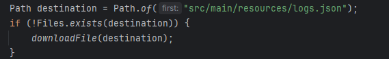
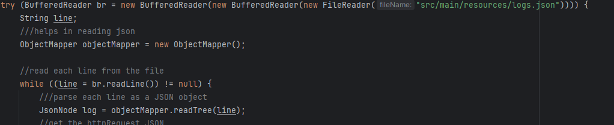
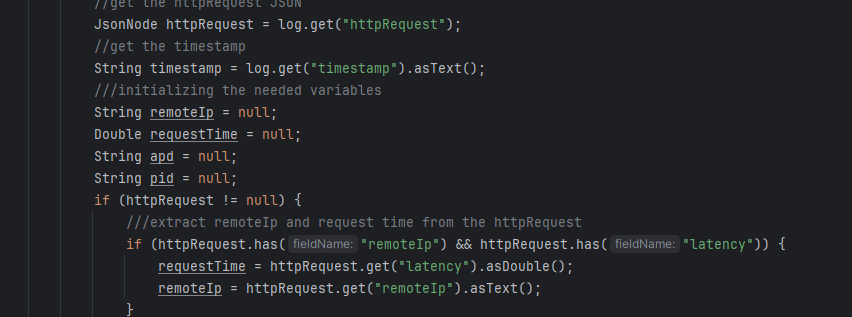
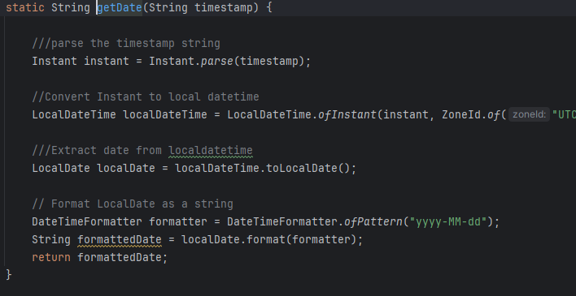
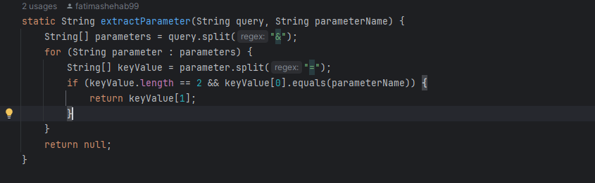
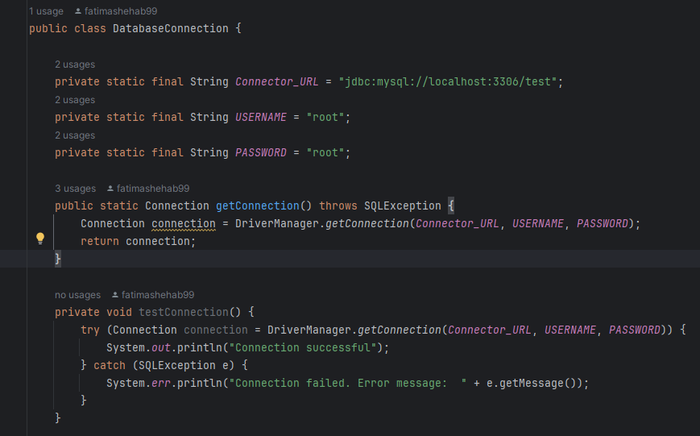
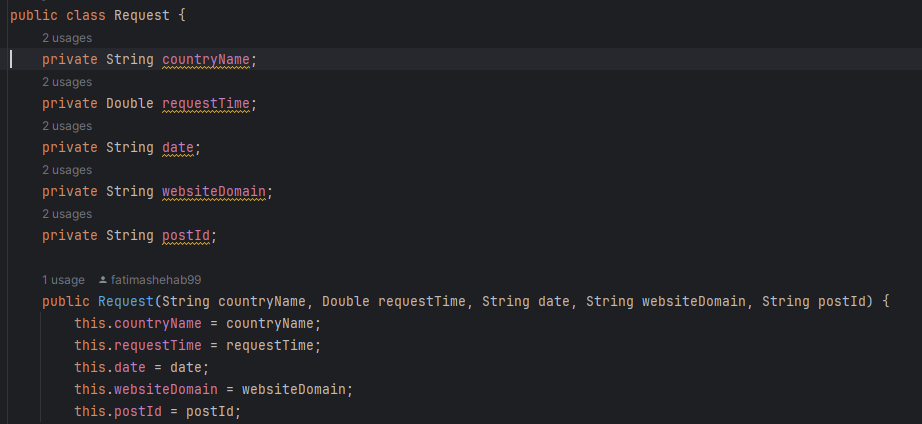

# Data Engineering Test

## 1. Downloading JSON Logs File
- **Description:** Downloads a JSON logs file from a specified path or creates a new one if it doesn't exist.
- **Functionality:**
  - Utilizes the `downloadFile()` function to establish a connection to the data URL and save the logs.json file.
  - Uses `Files.copy()` to save the data from the input stream into the logs.json file.

## 2. Parsing the Logs JSON
- **Description:** Parses the JSON logs file to extract necessary data using Jackson's Object Mapper.
- **Functionality:**
  - Iterates over each line of the JSON file to extract data into JSON Node objects.
  - Utilizes the Object Mapper from the Jackson dependency in the pom.xml file for parsing.

## 3. Getting Request and Country Name
- **Description:** Extracts request details and country names from JSON logs using MaxMind's GeoLite database.
- **Functionality:**
  - Extracts timestamp and httpRequest JSON for request details.
  - Utilizes `getCountryNameByIp()` function to retrieve country names from IPs using MaxMind's GeoLite database.

## 4. Getting Date from Timestamp
- **Description:** Parses timestamp to extract date using LocalDateTime object.
- **Functionality:**
  - Implements `getDate()` function to convert timestamp to LocalDateTime object for date extraction.

## 5. Getting Website Domain and PID
- **Description:** Extracts website domain and post ID from request URL.
- **Functionality:**
  - Extracts requestURL attribute from httpRequest JSON.
  - Utilizes `extractParameter()` function to retrieve website domain and post ID from the URL.

## 6. Inserting Data to the Database
- **Description:** Inserts extracted data into a MySQL database table.
- **Functionality:**
  - Establishes connection to MySQL database using `DatabaseConnection` class.
  - Defines `Request` class representing the table structure in the database.
  - Implements `addRequests()` function to efficiently insert data using batch processing.

### a. Database Connection
- Establishes connection to MySQL database.

### b. Request Class
- Defines table structure for the requests table in the database.

### c. Inserting Data
- Inserts data into the database using batch processing for improved performance.
- 
## 7. Visualizating data using PowerBi
The following diagrams shows the charts of the SQL views

This chart shows the top countries count

This chart shows the top domains count

This chart shows the top pid with respect to date but here I have only one date so because of that it appears in this way

