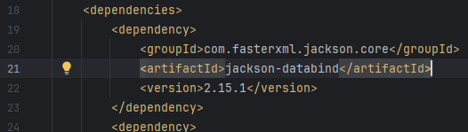

# data-engineering-test
1-Downloading JSON logs file

If the file does not exist to the path I specified , it will create a new json file using the downloadFile() function 

THe downloadFile() function save the logs.json file by opening a connection to the data URL using openStream() then returning an inputStream for reading the data that will be saved in the logs.json file by using the Files.copy() function

2-Parsing the logs JSON 

Reading JSON lines by looping over every line to be able to save the content of every JSON line to a JSON NODE object to extract the needed data. Object mapper helps me in that where I get it from jackson dependency that I add it to the pom.xml file .

3-Getting request , countryname 

First I get the timestamp since I want to extract the date later and the httpRequest JSON that contains the request time which is latency , remoteIp and request URL that I will extract the pid and website domain from it. 

The getCountryNameByIp() function returns the country name for each ip by using the GeoLite database and the maxMind dependency that I add in the pom.xml file

4-Getting date from timestamp 

I created a function getDate that parse the timestamp to LocalDateTime object to be able to get the date from it

5-Getting website domain and pid

I extract first the requestURL attribute from the httpRequest JSON . Then I created a function named extract Parameter that allows me to get the website domain and post id from the URL 

6-Inserting data to the database
  a-I first created the DatabaseConnection class where I created the connection to the MySql database 
  
  b-I created Request class which is the table needed in the database , the fields in the Request class are the columns for the requests table in the database
   
  c-I created a function named addRequests() that takes a list of Request object , add it to a batch then add the data to the database . I use batch since it is a better way to insert data while dealing with huge amount of data.

